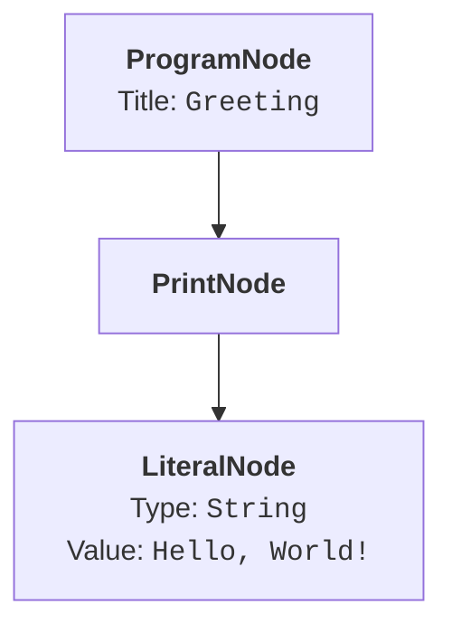
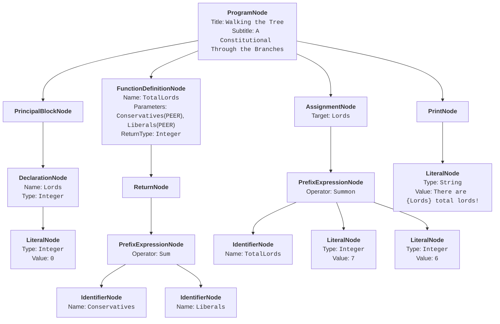

# Abstract Syntax Tree (AST)

The Abstract Syntax Tree (AST) is a hierarchical tree-like structure representing a computer programme and the nested form of the language grammar.  It is produced by the [Parser](./parser.md) and consumed by the [Runtime](./runtime.md) in the interpreter to execute the programme.

## Implementation

In the _Operetta Toolchain_ the AST is implemented in the `BWHazel.TopsyTurvy.Ast` namespace and comprises a set of basic classes representing the different language constructs.  All types inherit from the `Node` abstract class, from which concrete AST types inherit from the `Expression` or `Statement` abstract classes.  The top node in any Topsy Turvy programme is the `ProgramNode` class, which is an exception to other concrete classes by inheriting directly from `Node`.

### Node Types

The concrete node types, grouped by their base class, are listed below.

#### Root

|AST Node Class|Title|Description|
|-|-|-|
|`ProgramNode`|Programme Root|The root of every programme tree, corresponding to the `HARK!` ... `FINALE.` structure.  Holds the title, optional subtitle and all top-level statements.|

#### Statements

|AST Node Class|Title|Description|
|-|-|-|
|`ArrayDeclarationNode`|Array Declaration|Declares an array variable with a type, optional mutability modifier, optional size, and optional initialiser: `PRAY WELCOME` ... `AS A [CONSERVATIVE\|LIBERAL] LITTLE LIST OF [size] type [BEING` ... `IF YOU PLEASE.]`|
|`ArrayElementAssignmentNode`|Array Element Assignment|Assigns a value to an element at a 1-based index: `VICTIM <index> ON <array> IS APPOINTED <value>`.|
|`AssertNode`|Assert|Evaluates a condition and throws with a message if falsy: `THE LAW IS <condition> THAT <message>`.|
|`AssignmentNode`|Assignment|Assigns a new value to an existing variable: `IS APPOINTED`.|
|`BreakNode`|Break|Exits a loop or switch block immediately: `THAT WILL DO.`|
|`ConditionalNode`|Conditional|An if/else-if/else conditional: `SHOULD IT TRANSPIRE THAT` ... `SO MUCH FOR THAT.`|
|`ContinueNode`|Continue|Skips to the next loop iteration: `ONCE MORE.`|
|`DeclarationNode`|Variable Declaration|Declares a variable with a type, optional mutability modifier (`CONSERVATIVE` / `LIBERAL`), and optional initial value: `PRAY WELCOME`.  Carries an `IsConstant` flag: `true` when the `CONSERVATIVE` modifier is present.|
|`ExpressionCastNode`|Expression Cast|Casts an expression to a new type: `AS IT WERE` ... `AS A`.|
|`ExpressionStatement`|Expression Statement|Wraps a standalone expression used as a statement, such as a discarded function call.|
|`FunctionDefinitionNode`|Function Definition|Defines a named function with typed parameters, an optional return type and a body: `IT IS MY DUTY TO PERFORM` ... `MY DUTY IS DISCHARGED.`  Parameters are represented as `TypedParameter` records carrying the name, declared `LiteralType` and source span.  The optional `TO FIND <type>` clause sets `ReturnType` and a `null` return type indicates a void function.|
|`GuardNode`|Guard|Evaluates a condition and, if falsy, executes an else block: `YEOMAN <condition> OTHERWISE, <block> UNDER ORDERS.`|
|`ImportNode`|Import|Imports another `.topsy` file, making its functions available: `PRAY ADMIT`.|
|`InputNode`|Input|Reads a line from standard input into a variable as a `YARN` (string): `PRAY TELL`.|
|`LoopNode`|Loop|A loop block supporting ascending, descending, whilst and infinite forms: `BY A LEGAL FICTION` ... `THE TERM EXPIRES.`  The form is determined by the `LoopType` enum (see below).|
|`PrincipalBlockNode`|Principal Block|Groups variable declarations: `PRINCIPALS` ... `THE CURTAIN RISES.`|
|`PrintNode`|Print|Evaluates and prints an expression to standard output: `BEHOLD`.|
|`ProgrammeReturnNode`|Programme Return|Sets the OS exit code from the top level of the programme body, not inside a function: `AND SO I FIND <expr>`.  The expression must evaluate to a `PEER`.  Omitting this statement implicitly exits with code `0`.|
|`ReturnNode`|Return|Returns from a function with or without a value: `AND SO I FIND` / `MY DUTY IS PREMATURELY DISCHARGED.`|
|`SwitchNode`|Switch|Selects a block based on an expression value: `IN WHICH CAPACITY?` ... `NOTHING COULD BE MORE SATISFACTORY.`|
|`ThrowNode`|Throw|Raises an exception with a payload expression: `A HIDEOUS CURSE ON`.|
|`TryCatchNode`|Try-Catch|Wraps an operation, executing a success block or exception block based on the outcome: `WITH THE GREATEST RESPECT,` ... `THAT CONCLUDES THE MATTER.`|

#### Expressions

|AST Node Class|Title|Description|
|-|-|-|
|`ArrayIndexNode`|Array Index|Accesses an array element or string character at a 1-based index: `VICTIM <index> ON <array>`.|
|`ArrayLengthNode`|Array Length|Evaluates to the number of elements in an array or string: `RECKONING OF <array>`.|
|`IdentifierNode`|Identifier|References a named variable or function parameter.|
|`LiteralNode`|Literal|A fixed literal value: integer, float, string, character, boolean or null.|
|`PrefixExpressionNode`|Prefix Expression|All prefix operations (arithmetic, bitwise, logical, comparison, variadic and function calls) identified by the `Operator` enum (see below).|
|`TernaryExpressionNode`|Ternary Expression|Inline conditional expression: `<true-value> SHOULD IT TRANSPIRE THAT <condition> OTHERWISE, <false-value>`.  Only the false branch may itself be a ternary, enabling right-chaining.|

### Supporting Types

`TypedParameter` is a positional record used by `FunctionDefinitionNode` to represent a single declared parameter.  It is not a node in its own right and does not appear in the tree but is carried as a member of the node.

|Property|Type|Description|
|-|-|-|
|`Name`|`string`|The parameter identifier.|
|`Type`|`LiteralType`|The declared type.|
|`Span`|`SourceSpan`|The source position of the parameter declaration.|

### Enumerations

A couple of enumeration types are included and used in several of the nodes.

#### `LoopType` Enum

The `LoopType` enum determines the form of a `LoopNode`:

|Value|Keyword|Description|
|-|-|-|
|`Infinite`|(none)|Repeats indefinitely until a `THAT WILL DO.` break statement exits the loop.|
|`Ascending`|`ASCENDING`|Increments a counter variable by 1 each iteration, exiting when a condition becomes `VERITY`.  The counter starts from its current declared value.|
|`Descending`|`DESCENDING`|Decrements a counter variable by 1 each iteration, exiting when a condition becomes `VERITY`.  The counter starts from its current declared value.|
|`Whilst`|`WHILST`|Continues while a boolean expression evaluates to `VERITY`, checked before each iteration.|

#### `Operator` Enum

The `Operator` enum identifies the operation performed by a `PrefixExpressionNode`.  All operators use prefix notation where the operator keyword precedes its operands.

**Arithmetic Operators:** Binary operators producing a numeric result:

|Value|Keyword|Description|
|-|-|-|
|`Sum`|`SUM OF x AND y`|Addition.|
|`Difference`|`DIFFERENCE OF x AND y`|Subtraction.|
|`Product`|`PRODUCT OF x AND y`|Multiplication.|
|`Quotient`|`QUOTIENT OF x AND y`|Division.|
|`Remainder`|`REMAINDER OF x AND y`|Remainder (modulo).|
|`Larger`|`LARGER OF x AND y`|Maximum of two numbers.|
|`Smaller`|`SMALLER OF x AND y`|Minimum of two numbers.|

**Comparison:** Binary operators producing a `DECREE` (boolean) result:

|Value|Keyword|Description|
|-|-|-|
|`Alike`|`ALIKE x AND y`|Equality (`x == y`).|
|`Unlike`|`UNLIKE x AND y`|Inequality (`x != y`).|
|`PreAdamite`|`PRE-ADAMITE x AND y`|Greater than (`x > y`).|
|`LowerDegree`|`LOWER DEGREE x AND y`|Less than (`x < y`).|

**Logical:** Operators on `DECREE` (boolean) values:

|Value|Keyword|Description|
|-|-|-|
|`Both`|`BOTH x AND y`|Logical AND.|
|`Either`|`EITHER x OR y`|Logical OR.|
|`HardlyEver`|`HARDLY EVER x`|Logical NOT (unary).|

**Bitwise:** Integer-only operators; applying to non-integer types is a runtime error:

|Value|Keyword|Description|
|-|-|-|
|`ChordOf`|`CHORD OF x AND y`|Bitwise AND (`x & y`).|
|`HarmonyOf`|`HARMONY OF x AND y`|Bitwise OR (`x \| y`).|
|`DiscordOf`|`DISCORD OF x AND y`|Bitwise XOR (`x ^ y`).|
|`InversionOf`|`INVERSION OF x`|Bitwise NOT, unary (`~x`).|
|`TranspositionUp`|`TRANSPOSITION UP x`|Left shift by 1, unary (`x << 1`).|
|`TranspositionDown`|`TRANSPOSITION DOWN x`|Right shift by 1, unary (`x >> 1`).|

**Variadic:** Accept two or more operands, closed by `IF YOU PLEASE.`:

|Value|Keyword|Description|
|-|-|-|
|`WovenOf`|`WOVEN OF x AND y [AND z ...] IF YOU PLEASE.`|String concatenation; each operand is cast to `YARN` before joining.|
|`AllOf`|`ALL OF x AND y [AND z ...] IF YOU PLEASE.`|Variadic logical AND; all operands must be `VERITY`.|
|`AnyOf`|`ANY OF x AND y [AND z ...] IF YOU PLEASE.`|Variadic logical OR; at least one operand must be `VERITY`.|

**Function Call**:

|Value|Keyword|Description|
|-|-|-|
|`Summon`|`SUMMON name WITH arg [AND arg ...] IF YOU PLEASE.`|Calls a named function with zero or more arguments.|

### Source Positions

Every `Node` carries a required `Span` property, of type `SourceSpan`, recording where in the source code the node originated.  This is used by the _Operetta Toolchain_ to report errors and warnings at the correct position.  The `Span` is populated by the [Parser](./parser.md) at parse time by consulting the `SourceMap` produced by the [Pre-Processor](./pre-processor.md), which translates the absolute character offset at the start and end of each parsed construct back to the original source line and column.

A `PlaceholderSpan` of `(Line: 0, Column: 0)` / `(Line: 0, Column: 0)` is returned only when no `SourceMap` is available, which occurs solely in specific intended situations, such as isolated tests that invoke the parser directly without a pre-processing step.  In all normal execution paths every node carries real source positions.

A `SourceSpan` is a pair of `SourceLocation` values:

* `Start`: The position of the first character of the node.
* `End`: The position one column past the last character of the node (exclusive).

A `SourceLocation` identifies a single point by a **1-indexed** line and column number.  For example, the first character of a file is at line 1, column 1.  A span covering the keyword `BEHOLD` at the start of line 3 would be:

```
Start: (Line: 3, Column: 1)
End:   (Line: 3, Column: 7)
```

The `SourceSpan` and `SourceLocation` types work in sequence with the `SourceMap` produced by the [Pre-Processor](./pre-processor.md), which translates offsets in the transformed source text back to their original positions before pre-processing.

### Diagnostic Types

As part of the parsing process, diagnostics, such as errors, can be raised and used by editors to highlight issues in the code.  These are represented by the `Diagnostic` and `DiagnosticCollection` classes, included in the AST to simplify the architecture and prevent circular dependencies within the codebase.  Please see the [Language Server](./language-server.md) page for more information on how these are used.

## Example

To demonstrate the structure, the following basic "Hello, World!" example in Topsy Turvy:

```
HARK! "Greeting"

BEHOLD "Hello, World!"

FINALE.
```

would be represented by the following AST:



This minimal programme illustrates the core pattern: `ProgramNode` is always the root of the tree and every statement hangs from it as a child node.  The `PrintNode` holds a single child expression: here a `LiteralNode`, which is evaluated and printed when the interpreter "walks" to it.

A more complete example demonstrates a wider range of node types.  The following programme declares variables, defines a function and calls it:

```
HARK! "Walking the Tree"
  or, "A Constitutional Through the Branches"

PRINCIPALS
    PRAY WELCOME Lords AS A PEER BEING 0
THE CURTAIN RISES.

IT IS MY DUTY TO PERFORM TotalLords UNDER THE TERMS OF Conservatives AS A PEER AND Liberals AS A PEER TO FIND PEER
    AND SO I FIND SUM OF Conservatives AND Liberals
MY DUTY IS DISCHARGED.

Lords IS APPOINTED SUMMON TotalLords WITH 7 AND 6 IF YOU PLEASE.
BEHOLD "There are {Lords} total lords!"

FINALE.
```



* The `PrincipalBlockNode` groups the variable declarations.  The `DeclarationNode` carries its `Name` and `Type` directly, and its `InitialValue` as a genuine child expression, here a `LiteralNode`.
* The `FunctionDefinitionNode` contains the function body as a list of statements: a single `ReturnNode` wrapping a `PrefixExpressionNode` for the `SUM OF` expression.
* The assignment calls the function using `Operator.Summon`, passing `7` and `6` as `LiteralNode` arguments.
* Finally, the `PrintNode` prints the interpolated string.