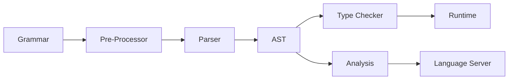

# Language Design

The _Operetta_ implementation of Topsy Turvy uses standard conventions in programming language design, split into stages:

* A formal language [**Grammar**](./grammar.md) and specification define the Topsy Turvy language.
* The source code is transformed by the [**Pre-Processor**](./pre-processor.md) to simplify or remove unnecessary components.
* The transformed code is then parsed through a [**Parser**](./parser.md), which is split into several layers, all underpinned by the Lexer, which identifies individual tokens.
* The result of the parser is an [**Abstract Syntax Tree (AST)**](./ast.md) which is a hierarchical tree-like representation of the source code.
* The AST is then checked by the [**Type Checker**](./type-checker.md), which verifies that all types are used consistently before execution begins.
* The checked AST can then be run in a [**Runtime**](./runtime.md) environment, such as by the Interpreter, as an actual running programme.

Additionally, the AST can undergo [**Analysis**](./analysis.md) to provide useful information and rich experiences when working with code, exposed to editors and tools via a [**Language Server**](./language-server.md).

