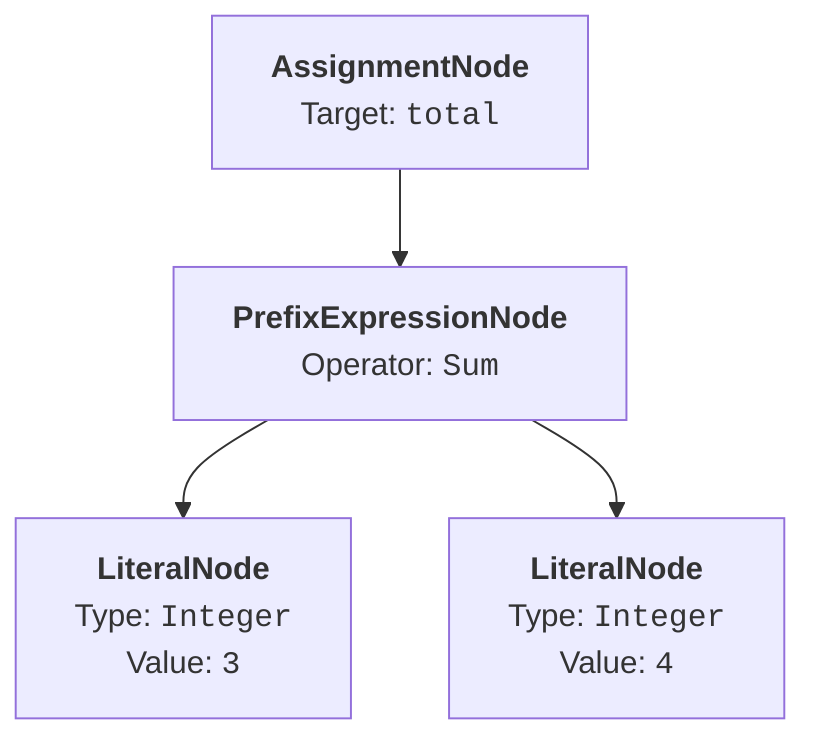

# Parser

The parser processes the source code from a stream of text into a hierarchical tree-like structure representing the code, the [Abstract Syntax Tree](./ast.md) or AST.  A lexer converts the stream of characters into tokens, which can be considered analogous to words and represent literals, such as numbers and strings, whitespace, keywords and punctuation.  These tokens are then passed through the parser to build expressions, which in turn build statements, all of which combine to form the complete programme as a sequence of statements.

Expressions are constructs which produce a value when evaluated.  They never stand alone and are always part of, and input to, statements.  Examples include:

* Literals, e.g. `"Hello, World!"`, or,
* Arithmetic operations, e.g. `SUM OF 3 AND 4`.

Statements on the other hand perform an action when executed and stand alone.  They execute in sequence with other statements and have side-effects, such as affecting other data.  Using the expression examples, statements could be assignments:

* `greeting IS APPOINTED "Hello, World!"`, or,
* `total IS APPOINTED SUM OF 3 AND 4`

Additional statement examples include function declarations, in-place casts, and array element assignments to name a few.

## Example

As an example to demonstrate the parsing process, the following Topsy Turvy statement assigns the result of an arithmetic expression to a variable:

```
total IS APPOINTED SUM OF 3 AND 4
```

As the character stream is processed, the lexer parsers identify the following tokens.  Whitespace is consumed and discarded at this stage:

|Token Type|Value|
|-|-|
|Identifier|`total`|
|Keyword|`IS APPOINTED`|
|Operator|`SUM OF`|
|Integer|`3`|
|Integer|`4`|

`AND` is not a standalone lexer token here: it is consumed as a separator between operands at the expression parser level.

The parser then assembles these tokens into the following AST:



The `AssignmentNode` captures the `IS APPOINTED` operation: it records the target variable name, `total`, and holds the right-hand side as a child expression.  That expression is a `PrefixExpressionNode` using the `Sum` operator, `SUM OF`, whose two arguments are `LiteralNode` instances each holding their integer values `3` and `4`.

It should be noted this is only a **partial** AST.  In a real programme a `ProgramNode` would always be the top node in the tree.

## Implementation

In the _Operetta Toolchain_, the parser, including the lexer, is implemented in the `BWHazel.TopsyTurvy.Parser` namespace.  Its components for performing the parsing are implemented using [Superpower](https://github.com/datalust/superpower) which uses LINQ query notation to build parsers which can be used to build other parsers and are therefore known as combinators.  This approach means the parsing process is slightly different to how it is described above in that the programme parser is the entry point and not the lexer; the lexer process is completed as part of the main parsing process.

The main entry point for the parser is in the `TopsyTurvyParser` class which then passes the code through subsequent parser layers, the `StatementParser`, `ExpressionParser` and `Lexer` to generate the AST.  It is arranged in these layers as, from bottom up, the lexer handles individual characters and words, the expression parser handles values and operators and the statement parser handles complete instructions.  `TopsyTurvyParser` provides two methods for performing a parse, both of which take the raw source text and run it through the [Pre-Processor](./pre-processor.md) internally before parsing:

|Method|Return Type|Description|
|-|-|-|
|`Parse()`|`ProgramNode`|Fails fast on parsing errors, ideal for callers where errors are fatal such as when the code is being executed in an interpreter.  The `ProgramNode` type is the top layer of the AST.|
|`TryParse()`|`ParseResult`|Completes a parse even on parsing errors, ideal for callers where errors are data that needs to be inspected such as in a code editor to highlight issues.  The `ParseResult` type contains information on a parse (please see below).|

The `ParseResult` type returned from the `TryParse()` method contains:

* A `ProgramNode` instance on a successful parse, otherwise is `null`.
* A `Diagnostics` collection with a list of parsing diagnostics, such as errors or warnings, even on a successful parse.
* A `Success` property indicating whether a successful parse occurred.

### Source Span Capture

As the parser builds each AST node it captures the absolute character offset at the start and end of each parsed construct using a position-capture parser that reads the cursor position without consuming any input.  These offsets are translated to original source line and column positions via the `SourceMap` produced by the [Pre-Processor](./pre-processor.md).

The `SourceMap` is communicated to the parser static combinator fields through a thread-local field set by `TopsyTurvyParser` immediately before the parse begins and cleared in a `finally` block once the parse completes.  Parsing is always synchronous and single-file per call, so this is safe.  When no `SourceMap` is available, for example in specific and intended situations such as isolated tests that call the parser directly, a `PlaceholderSpan` of `(Line: 0, Column: 0)` / `(Line: 0, Column: 0)` is used as a fallback.  Please see the [AST](./ast.md) page for more information on source spans.

### Committed Parse Semantics

When parsing the parser is able to backtrack on failure but on some occasions, such as parsing a statement, this can lead to errors being reported in incorrect locations, i.e. at the start of a line or whole block rather than the actual error location.  By implementing committed parse semantics, errors in a statement are reported at the location of the error allowing for a better development experience.  It should be noted, however, that subsequent errors are not reported.

## Creating a Parser

Parsers should only be added to _Operetta_ when changes to the Topsy Turvy language occur, however, a couple of examples are included below.  They demonstrate the use of both method-chaining, which is best suited for simple linear matches, and LINQ query notation, which is more readable for sequences of several parsers.  For more complicated examples please see the code base and refer to the [Superpower](https://github.com/datalust/superpower) documentation.  At its core a parser is a cursor through the source code moving forwards during the parsing although, as will be seen, may need to backtrack.

### Boolean Literal (Lexer Example)

An adjusted form of the Boolean literal used in the codebase is outlined below.  It is used to match on the `VERITY` and `NAY` Boolean literal values in Topsy Turvy representing `true` and `false` respectively.

```cs
TextParser<bool> BooleanLiteral =
    Span.EqualToIgnoreCase("VERITY")
        .Try()
        .Select(_ => true)
        .Or(Span.EqualToIgnoreCase("NAY")
            .Try()
            .Select(_ => false));
```

* It first matches on the whole `VERITY` keyword (case-insensitive) as indicated by the `Span` type rather than individual characters.
    * If it is a successful match the parser returns a `true` value as expected.
* However, if the match fails it moves back to where it started, enabled by `Try()`, to match on the whole `NAY` keyword (also case-insensitive).
    * If it is a successful match the parser returns a `false` value as expected.

Note the use of the `_` C# value: the parser does return a value but it is not needed as `true` and `false` suffice.  Also the `Select()` method is used to convert the parser match result into another type, in this case a `bool`.

### Boolean Initial Value (Parser Example)

:::warning
Please note that this parser included here is **not** part of the _Operetta_ implementation but included purely for demonstrative purposes on how to build parsers.
:::

This parser demonstrates how parsers can be used by other parsers as well as the LINQ notation.

```cs
TextParser<bool> BooleanInitialValue =
    from beingKeyword in Lexer.Keyword("BEING")
    from whitespace in Lexer.WhitespaceRequired
    from initialValue in Lexer.BooleanLiteral
    select initialValue;
```

* It first matches on the `BEING` keyword for assigning a value, a parser implemented in the Lexer, and the resulting value is discarded.
* It then matches on required whitespace, another parser implemented in the Lexer, the resulting value from which is also discarded.
* It then matches on the literal Boolean value, using the parser described above, and returns it as a `bool`.
