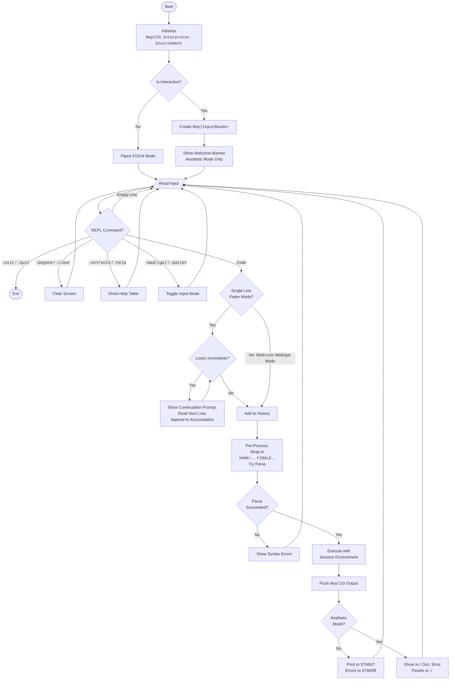

# CLI REPL

The _Operetta CLI_ includes a _Read-Eval-Print Loop_ (REPL) for fast prototyping with Topsy Turvy and experimenting with language features.

## Implementation

At its core the REPL is based on the `Interpreter` and `TopsyTurvyEnvironment` classes of the _Operetta Toolchain_.  However, there are several differences to how the REPL operates compared to running a Topsy Turvy script directly through the interpreter:

* The REPL maintains a separate environment which persists variable and function declarations between successive calls to the interpreter to execute user-entered code at the REPL prompt.
* Command-line arguments are not available in the REPL.
* User-entered code is automatically wrapped with the standard programme structure keywords when processed so the user does not need to provide them on each input.
* Multi-line code blocks (when in single line _Patter_ mode) are handled by processing each line on input: if the parser throws an error where `FINALE.` is unexpected, it is treated as a line within a code block and therefore offers a continuation prompt until complete.  Please see the implementation details below for an example.

The REPL is implemented in the `BWHazel.TopsyTurvy.Cli.Repl` namespace and is based on the following main classes:

* **`ReplSession`:** Main entry-point and orchestrator for a single REPL session: it reads user input, processes REPL commands, calls the pre-processor, parser and interpreter then renders the output.  Also handles the continuation prompt for code blocks in single-line _Patter_ mode.
* **`ReplIO`:** A specialised implementation of `ITopsyTurvyIO` for a rich user experience in the REPL, including colour, input and output panels and a user input prompt for `PRAY TELL` calls.
* **`ReplInputReader`:** Low-level keystroke processing offering several enhancements over the standard terminal, including styled prompts, in-line terminal cursor movement, backspace, input history navigation, multi-line accumulation (when in multi-line _Madrigal_ mode) and in-line syntax highlighting.
* **`ReplHighlighter`:** Applies syntax highlighting to a user input string on the REPL prompt.

For the purposes of this documentation, running the REPL without the `--tiptoe` flag will be referred to as **Aesthetic Mode** whereas with the flag will be referred to as **Tiptoe Mode**.

### REPL Session

The Session is the main entry-point and orchestrator to the REPL performing all initial configuration by creating the persisted environment and specialised I/O.  It also creates a `ReplInputReader` if stdin is attached to a terminal (interactive mode).  Once initialised, the core activity of the Session is the REPL loop.



#### Read

A line of input is read from the user using the `ReplInputReader` which provides cursor editing, history, and, when in **Aesthetic Mode**, syntax highlighting.  If the REPL is started using code passed in via a pipe, standard input from the built-in .NET `Console` is used.

Not every user input will be a line of Topsy Turvy as the REPL supports several commands starting with `:`.  The input is checked for one of these commands and executes one if identified.

#### Evaluate

At this point the input is treated as Topsy Turvy code and is evaluated by calling the `EvaluateInput()` method on the `ReplSession`.  The input is passed through the pre-processor, wrapped with the `HARK!` ... `FINALE.` programme keywords and sent to the parser to try parsing using its `TryParse()` method to catch any errors.  For example, the input:

```
PRAY WELCOME LovesickMaidens AS A PEER BEING 42
```

would be wrapped as:

```
HARK! "Cadenza"
PRAY WELCOME LovesickMaidens AS A PEER BEING 42
FINALE.
```

If the REPL is in single-line _Patter_ mode and an error occurs on the final line, where the `FINALE.` is unexpected, it is assumed a code block is still open so the REPL provides the continuation prompt until this error no longer occurs.  This is driven by the `AccumulateUntilComplete()` and `LooksIncomplete()` methods.  In multi-line _Madrigal_ mode the user inputs code until a blank line is detected and the whole input block is processed: if an error is raised here it is due to invalid Topsy Turvy code in the input.

Before evaluation, the input is added to the history list so it can be recalled with the arrow keys in subsequent turns.  It is then passed to the interpreter for execution along with the persisted environment, enabling declarations to be reused from one REPL input to the next.

#### Print

Once execution is complete, the `ReplIO` instance flushes and resets its output, which is printed to the console.  In **Tiptoe Mode** output is printed to Standard Output and any errors to Standard Error.  In **Aesthetic Mode** it prints a panel for the provided user input and another for the output or error, coloured accordingly.  If there is no output then a visual acknowledgement of completion is printed instead of an output panel.

### Input Reader

The `ReplInputReader` handles all low-level input from the user providing a richer editing experience than the standard terminal.  It is responsible for showing the prompt, capturing individual keystrokes, maintaining an editable input buffer for user input and, when in **Aesthetic Mode**, applying syntax highlighting as the user types.

#### Prompt

When `ReadInput()` is called by `ReplSession` it determines the input mode before showing the prompt, which is different depending on the mode.  When the user presses `Enter` it calls its `ReadSingleLine()` method:

* In **single-line _Patter_ mode** it is called once and returns the result immediately.
* In **multi-line _Madrigal_ mode** it is called in a loop, accumulating each submitted line until the user enters a blank line, at which point all accumulated lines are joined and returned as a single block.

#### Key Reading

After showing the prompt, `ReadSingleLine()` enters a keystroke-processing loop.  Each iteration calls `Console.ReadKey(intercept: true)` which captures a keystroke without echoing it or moving the terminal cursor.  The loop continues until the user presses `Enter`, returning the input buffer contents, or issues a control shortcut such as `Ctrl+C`, returning a control key command.

:::warning
**Using the `intercept: true` parameter on `Console.ReadKey()` is essential.**

If the terminal were allowed to echo the character automatically it would also move the cursor which is outside the control of any key handler, outlined below in **Key Dispatch**.  Capturing keystrokes silently gives each handler full control over what is written to the terminal and where the cursor lands, which is the foundation of keeping the cursor in sync, described below.
:::

#### Key Dispatch

Each captured key is tested against a chain of handlers in order.  The first handler to recognise the key consumes it and the loop moves to the next keystroke:

* **Enter Key:** Checked directly in the loop, emits a newline and returns the current input buffer contents.
* **Control Key Commands (`GetControlKeyCommand`):** `Ctrl+C` or `Ctrl+D` on an empty buffer returns the exit REPL command whereas `Ctrl+L` returns the clear screen command.
* **Backspace (`HandleBackspace`):** Removes the character immediately to the left of the cursor and redraws the line.
* **Cursor Movement (`HandleCursorMovement`):** The left and right arrow keys as well as `Home` and `End` move the cursor without affecting the input buffer.
* **History Navigation (`HandleHistoryNavigation`):** The up and down arrow keys replace the buffer with a previous or later history entry respectively and redraw the line.
* **Character Insert (`InsertCharacter`):** Any non-control character is inserted at the cursor position and the line is redrawn.

#### Keeping the Cursor in Sync

:::warning
**At the start of every iteration of the keystroke loop the terminal cursor column position exactly equals the input buffer current cursor position.**

This is the key property that makes all of the above handlers work correctly.
:::

This rule holds because `Console.ReadKey(intercept: true)` never echoes a character or moves the terminal cursor: after it returns, the cursor is exactly where the previous iteration left it.  Each handler is then responsible for keeping the two in sync, either moving the terminal cursor and updating the input buffer cursor position to match, or issues a full redraw that brings both back into alignment.

The benefit is that any handler needing to move the cursor back to the start of the input buffer, for example before erasing and redrawing a highlighted line, can emit exactly as many backspaces as the current cursor position with no additional book-keeping needed.

The example below shows a backspace applied to the end of the keyword `BEHOLD`.  Before the key press the buffer contains 6 characters and the cursor is at column 6:

```
Buffer:   B  E  H  O  L  D
Index:    0  1  2  3  4  5
Terminal: B  E  H  O  L  D
                            ↑  Column 6
```

Backspace is read silently so the terminal cursor has not moved.  The handler then performs the following steps:

1. Record the current terminal column (6) before modifying the input buffer.
2. Remove `D` from the buffer: cursor position becomes 5.
3. Emit 6 backspaces: cursor moves to column 0.
4. Emit 6 spaces: erases old content.
5. Emit 6 backspaces: cursor returns to column 0.
6. Render the highlighted buffer `BEHOL`: cursor lands at column 5.
7. Emit 0 backspaces: cursor stays at column 5.

After the backspace the buffer and terminal are back in alignment:

```
  Buffer:   B  E  H  O  L
  Index:    0  1  2  3  4
  Terminal: B  E  H  O  L
                           ↑  column 5
```

The same full-line erase-and-redraw pattern applies to character insertion: the terminal column before the insert is recorded, the character is placed into the input buffer and the entire line is re-rendered with syntax highlighting before the cursor is repositioned.

### Highlighter

`ReplHighlighter` is a static class with a single public method, `Highlight()`, which takes a line of Topsy Turvy source text and returns a marked-up string with colour codes applied ready for rendering on the terminal.  As it has no state, given the same input it always produces the same output.

:::note
`ReplHighlighter` is only active in **Aesthetic Mode**.  In **Tiptoe Mode** no highlighting is applied and input is echoed to the terminal without markup.
:::

#### Keyword Table

Before any highlighting can take place, the highlighter must know which words to colour and what colour to apply.  These are stored in a keyword table, a list of pattern and colour pairs covering every category of Topsy Turvy keyword.

| Category | Colour |
|---|---|
| Programme Structure | Bold Green |
| Control Flow | Blue |
| Declarations | Purple |
| Type Names | Cyan |
| Operators | Orange |
| I/O and Functions | Green |
| Boolean Literals | Gold |
| Null Literal | Grey |
| Special Variables | Bold Cyan |

As Topsy Turvy uses multi-word keywords, a shorter keyword can be a prefix of a longer one, for example `PRAY TELL` and `PRAY WELCOME` both begin with `PRAY`.  To ensure the correct keyword is always matched in full the table is sorted by length in descending order when the class is first loaded.  This means longer patterns are always tried before shorter ones.

For example, given the input `PRAY TELL x`, the highlighter reaches position 0 and tries the longest entry in the table first.  It eventually reaches `PRAY TELL`, finds a word boundary after it and matches the entire phrase as one I/O token.  The shorter `PRAY`, which also appears in the table, is never reached.

#### Scanning

The highlighter processes the input string one character at a time, left to right, building up the output as it goes.  At each position it tries the following token types in order, moving on to the next only if the current one does not match:

1. **Comment:** If the remaining text starts with `ASIDE:` scanning stops since everything after a comment marker is part of the comment.
2. **String Literal:** If the current character is a double-quote, characters are consumed until the matching closing double-quote.  The tilde character, `~`, acts as an escape so `~"` inside a string does not close it.
3. **Numeric Literal:** If the current character is a digit, or a minus sign immediately followed by a digit, digits and an optional decimal point are consumed.
4. **Keyword:** Each entry in the keyword table is tried in order, longest first.  A match requires both that the text at the current position starts with the keyword, case-insensitively, and that a valid word boundary follows it (please see below).
5. **Plain Character:** If none of the above matched then the character is emitted without any colour markup.

#### Word Boundaries

Matching a keyword by text alone is not enough.  As an example, the word `PEER` must not match inside the identifier `PEERAGE`.  After a keyword is found in the text the character immediately following it is checked to confirm a word boundary exists.

Keywords that end with punctuation such as `.`, `!`, `?` or `,` are self-delimiting: the punctuation itself marks the end of the keyword so no further check is needed.  For all other keywords the next character must be a non-letter, i.e. a space, digit, punctuation or the end of the input, for the match to be accepted.  If the boundary check fails the keyword is skipped and scanning continues with the next entry in the table.